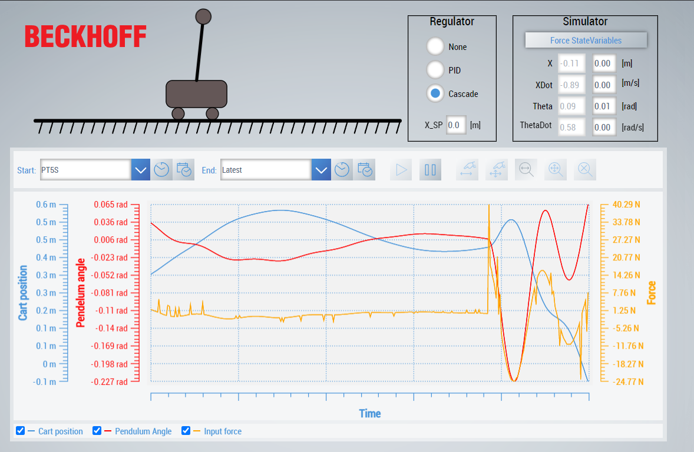

# TwinCat_InvertedPendulum
Inverted pendelum on a cart simulator and regulator

# Task

| Symbol   |                             |
|----------|-----------------------------|
| $m_p$       | mass pendelum               |
| $m_c$       | mass cart                   |
| L        | length to center of mass    |          
| F        | External force on cart      |
| X        | Horizontal position of cart |
| Theta    | Angle of pendulum           |
| g        | gravity                     |

# Simulator
System sumulated using forward Euler method.
Differnetial equations of the system:
$$
m_p \ddot{X} \cos{\theta} + m_p L \ddot{\theta} = m_p g \sin{\theta}
$$
$$
(m_p+m_c)\ddot{X} = F + m_p L (\dot{\theta}^2 \sin{\theta} - \ddot{\theta} \cos{\theta})
$$

# Regulator
Pendelum angle and cart position is controlled using two cascaded PD regulators. The inner one controls pendelum angle while the outer one controls the cart position.

# HMI
HMI shows a graphical representation of the cart and pendelum, and trend lines. It is also possible to select regulator mode, and forcing/resetting state variables.
